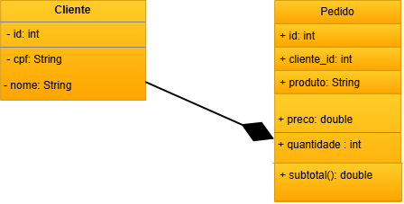

# Pedidos Backend MVC DC 
---
back-End com duas coleções mockup JSON clientes e pedidos, CRUD, para aprender, MVC e UML diagrama de classes.

# Diagrama- UML DC 
---


# Tecnologias
---
 - Node.js
 - VsCode (Thunder Client)
 - JavaScript
 - MVC 

 # Passos para testar
 ---
 - Clone este repositório e abra o VsCode 
 - Instale as dependências e execute com os seguintes comandos no terminal:

```
npm install
npm run dev
...
```
